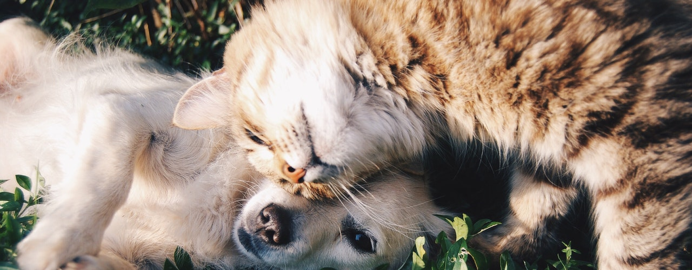

    

## :sunrise_over_mountains: Basic Overview

The challenge was to create an image classifier for cats and dogs and to create a webapp to use it. 

#### :date: Timeframe for the project
Completion of the webapp and model was meant to be achieved within 1 week. (20.04.20-27.04.20)

#### :clapper: Presentation

To view the complete WebApp clone this project and run main.py. Here is a short preview of the site:

    

## :boy: Author

**Tobias Becher**
- GitHub [TB-DevAcc](https://github.com/TB-DevAcc/)
- LinkedIn [Tobias Becher](https://www.linkedin.com/in/tobias-becher-b34341197)
- Hackerrank [TB_DevAcc](https://www.hackerrank.com/TB_DevAcc)

## :pray: Acknowledgments

[CoderSchool](https://www.coderschool.vn/en/) for their help, support & mentorship  
Titlephoto from [Snapwire](https://www.pexels.com/@snapwire) from Pexels  
!Website Main Images from Pexels  
!Icons made by Freepik, Monkik, Pongsakornred, dinosoftlabs, pixel-perfect from <a href="https://www.flaticon.com/" title="Flaticon"> www.flaticon.com</a>  

## 📝 License

Copyright © 2020 [Tobias Becher](https://github.com/TB-DevAcc).  
This project is [MIT](https://github.com/kefranabg/readme-md-generator/blob/master/LICENSE) licensed.
